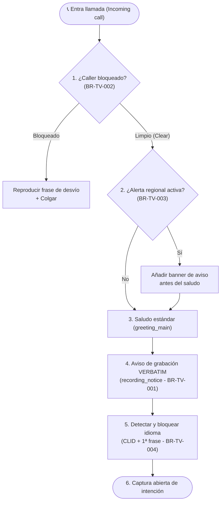
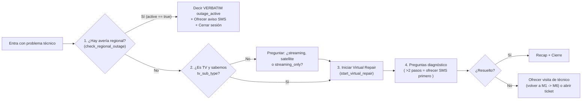

# ⚡ Guía Definitiva (ADHD-Friendly): Telco Voice Central

> **¿Qué es este documento?**
> Es el **100% del PDF de 25 páginas (*Telco Voice Central — Agent Development Brief*)**, sin saltarse **ni un solo dato, variable, frase o requisito**, pero estructurado con **bloques visuales, esquemas, tablas rápidas y negritas** para que puedas escanearlo en segundos sin perderte en muros de texto.

---

## 🎯 1. TL;DR en 30 Segundos (Lo que tienes que construir)

- **Qué construimos:** El agente de voz principal (`audio`) de atención al cliente de una teleco (**Telco**).
- **Qué resuelve (los 6 motivos de llamada + idioma secundario):**
  1. 🛠️ **Soporte Técnico (`M4`)** — `~30%` del tráfico *(el más grande)*
  2. 💳 **Facturación y Pagos (`M3`)** — `~25%` del tráfico
  3. 🛒 **Ventas y Equipos (`M5`)** — `~15%` del tráfico
  4. 👤 **Gestión de Cuenta (`M7`)** — `~15%` del tráfico
  5. 📅 **Citas y Técnicos (`M6`)** — `~10%` del tráfico
  6. 🔄 **Cambios de Servicio (`M3 + M7`)** — `~5%` del tráfico
  7. 🌐 **Fallback en Idioma Secundario (`M8`)** — Para soporte técnico cuando `M4` no cubre ese síntoma en el segundo idioma.
- **Libertad de arquitectura (`Modules ≠ Agents`):**
  El PDF habla de **8 Módulos (`M1` a `M8`)**. Un "módulo" es una **capacidad funcional**, NO necesariamente un sub-agente separado. Tú eliges la arquitectura (1 agente monolítico, un Hub-and-Spoke con sub-agentes, tools, etc.). **El test evalúa el comportamiento externo, NO la estructura interna** *(salvo donde exige orden explícito, p. ej. autenticar antes de leer datos o volver a `M1` para cambiar de módulo)*.
- **Meta de Producción (*Definition of Done* — Sección 21):**
  - ✅ **$\ge 60\%$** resolución sin humano (*in-agent resolution*)
  - ✅ **$\le 4\text{ min}$** tiempo medio de llamada (*AHT*)
  - ✅ **$100\%$ cumplimiento verbatim** (frases legales exactas letra por letra)
  - ✅ **$0$ fugas de PII** (jamás leer cuentas/tarjetas completas ni repetir PIN/OTP)
  - ✅ **$100\%$ grabación de audio** (`.wav` en el bucket)
  - ✅ **$\ge 90\%$ pass rate** en los 7 escenarios (`CUJ-1` a `CUJ-7`) antes de producción (`$\ge 60\%$` en baseline).

---

## 🚨 2. La Jerarquía de Prioridades (Sección 20) — *¿Qué gana si pasan 2 cosas a la vez?*

Si en un mismo turno coinciden dos reglas, **SIEMPRE gana la que esté más arriba en esta lista (1 = máxima prioridad)**:

| Prioridad | Situación | Qué debe hacer el agente inmediatamente |
| :---: | :--- | :--- |
| **1️⃣** | **Señales de Seguridad (`Safety`)** *(autolesión, amenazas, input malicioso `BR-TV-016`)* | Emitir línea de empatía / cierre educado + escalar o cerrar sesión (`reason: malicious_input`). **Pisa a todo lo demás.** |
| **2️⃣** | **Alerta de Fraude (`Fraud claim` `BR-TV-013`)** | Emitir frase verbatim `empathy_protocol` + escalar con `reason: fraud_escalation`. **PROHIBIDO intentar autenticar ni hacer self-serve.** |
| **3️⃣** | **Error Grave de Sistema (`System-error` `BR-TV-010`)** | Si una tool devuelve `SYSTEM_DOWN`, `INTERNAL_ERROR` o `AUTH_SERVICE_UNAVAILABLE` $\rightarrow$ cerrar/escalar en el acto con `reason: system_unavailable`. **No reintentar.** |
| **4️⃣** | **Petición explícita de hablar con humano** *("I want to talk to a person")* | Emitir frase verbatim `live_agent_handoff` + terminar sesión con `reason: user_requested_agent`. |
| **5️⃣** | **Cuenta de Empresa (`business_flag == true` `BR-TV-012`)** | En ventas (`M5`) o cuentas business $\rightarrow$ emitir frase verbatim `business_handoff` + terminar con `reason: business_handoff`. **Sin self-serve.** |
| **6️⃣** | **3 Fallos seguidos (`Retry-strike` `BR-TV-006`)** | 3 silencios (`no_input_escalation`) o 3 no-entendidos (`disambig_max_attempts`) en el mismo módulo $\rightarrow$ escalar con cortesía. |
| **7️⃣** | **Frases Legales Verbatim (`BR-TV-011`)** | Aviso de grabación, preámbulo PCI, penalización por cancelación, confirmación de reembolso. **Prohibido cambiar una sola coma.** |
| **8️⃣** | **Acción Autenticada del Cliente** | Resolver la tarea real del usuario (mirar factura, agendar técnico, etc.). |
| **9️⃣** | **Desambiguación** | Si el usuario dice algo vago: **1 sola pregunta directa** (nunca recitar un menú). Máximo 3 intentos. |
| **🔟** | **Charla / Recap / Cierre** | Prioridad mínima; solo cuando nada de lo anterior aplica. |

---

## 🛡️ 3. Las 6 Reglas Globales (Sección 1 — Activas en TODOS los turnos)

1. 🎙️ **Aviso de Grabación (`BR-TV-001`):**
   - Se dice **verbatim** (`recording_notice`) en el saludo inicial.
   - ⚠️ **Trampa de auditoría:** Si el usuario interrumpe el saludo, **hay que volver a reproducir el aviso de grabación entero en el siguiente turno**. Si el usuario pregunta *"¿me estás grabando?"*, se vuelve a emitir **verbatim**.
2. 🌍 **Bloqueo de Idioma (`BR-TV-004`):**
   - Se detecta en el **Turno 1** usando el prefijo del teléfono (`clid`) + la primera frase del usuario (`primary` o `secondary`).
   - Queda **bloqueado toda la llamada**. Solo se desbloquea si el usuario pide cambiar explícitamente diciendo las palabras clave (`"primary language"` / `"secondary language"`).
3. 🔒 **Redacción de PII (`BR-TV-009`):**
   - Números de cuenta (`billing_account`), referencia de cliente (`cirn`), teléfono de callback y tarjetas: **SOLO se leen los últimos 4 caracteres** (ej. `+1-NXX-555-01xx`).
   - **PINs y códigos OTP:** **JAMÁS se repiten en voz alta ni en el texto**. El usuario los introduce y el agente solo confirma si fue válido o no.
4. 🛑 **Input Malicioso (`BR-TV-016`):**
   - Un clasificador corre en cada turno. Si salta $\rightarrow$ despedida educada y fin de sesión con `reason: malicious_input`.
5. ⚾ **Regla de los 3 Strikes (`BR-TV-006`):**
   - **3 silencios seguidos** (`local_noinput_counter == 3`) en el mismo módulo $\rightarrow$ escalar con `reason: no_input_escalation`.
   - **3 intentos fallidos de desambiguación** (`no_match_confirmation_count == 3`) en el mismo módulo $\rightarrow$ escalar con `reason: disambig_max_attempts`.
6. 🌙 **Horario Fuera de Oficina (`BR-TV-014`):**
   - Colas 24/7 **SIEMPRE abiertas** para: **Averías (`outage`)** y **Fraude (`fraud`)**.
   - Colas de **Ventas, Cambios de Plan y Citas**: cuando están cerradas, se redirigen al **siguiente día laborable (*next-business-day*)**.

---

## 📞 4. Ciclo de Vida de Entrada y Preprocesamiento por Turno (Secciones 3 y 6)

### A. Secuencia al entrar la llamada (Sección 3 — Orden obligatorio)

---

### B. Los 4 Pasos ANTES de que hable el modelo en CADA turno (Sección 6)

> ⚠️ **¡EL ORDEN IMPORTA!** Cambiar este orden rompe los evals:
> **1º DTMF $\rightarrow$ 2º No-input $\rightarrow$ 3º Tool-error $\rightarrow$ 4º Pre-checks de módulo.**

1. **1️⃣ Captura de DTMF (`BR-TV-007`):**
   - Si el usuario pulsa teclas (nativo o como texto `"user pressed 1234"`), se normaliza y se guarda en `dtmf_digits` para ese turno.
2. **2️⃣ Conteo de Silencios (`No-input accounting`):**
   - Si no hubo actividad del usuario, suma `+1` a `local_noinput_counter`.
   - Intento 1 y 2: pedir amablemente que repita.
   - Intento 3: despedida hacia agente y cerrar con `reason: no_input_escalation`.
   - *(Nota: `local_noinput_counter` se resetea a `0` cada vez que el usuario entra a un módulo nuevo).*
3. **3️⃣ Clasificación Tri-Estado de Errores de Tools (`BR-TV-010`):**
   - 🔴 **Error de Sistema** (`SYSTEM_DOWN`, `INTERNAL_ERROR`, `AUTH_SERVICE_UNAVAILABLE`) $\rightarrow$ **Fin inmediato** de sesión con `reason: system_unavailable`. Prohibido reintentar o inventar.
   - 🟡 **Error de Negocio** (`INSUFFICIENT_FUNDS`, `NOT_ELIGIBLE`, `ALREADY_APPLIED`, ...) $\rightarrow$ **Pasar al modelo**; el agente pide disculpas y ofrece una alternativa.
   - 🟠 **Error de Validación** (`INVALID_INPUT`, `MALFORMED_REQUEST`) $\rightarrow$ Sumar `+1` a `global_err_count` (si llega a 3 $\rightarrow$ fin con `reason: too_many_errors`) y pedir al usuario que aclare/repita.
4. **4️⃣ Pre-chequeos del Módulo:**
   - Lógica propia de cada módulo antes de hablar (ej. revisar si hay avería activa en la región).

**Y DESPUÉS del turno (*Post-turn hooks*):**
- Aplanar respuestas JSON anidadas de las tools en las variables de sesión planas de la Sección 5.
- Guardar inmediatamente cualquier variable de seguimiento que necesite el turno siguiente.

---

## 🧭 5. Tabla Maestra de Intenciones y Enrutamiento (Sección 4)

| Qué dice el usuario (Ejemplos) | A qué módulo va | ¿Requiere Autenticación (`M2`)? |
| :--- | :---: | :--- |
| *"my bill is wrong"* / *"dispute a charge"* | **M3** (Billing) | ✅ **Sí** (`Authenticated`) |
| *"I want to pay my bill"* | **M3** (Billing) | ✅ **Sí** (`Authenticated`) |
| *"set up autopay"* | **M3** (Billing) | ✅ **Sí** (`Authenticated`) |
| *"refund"* / *"credit back"* | **M3** (Billing) | ✅ **Sí** (`Authenticated`) |
| *"internet is down"* / *"no service"* | **M4** (Tech Support) | ✅ **Sí** (`Authenticated`) |
| *"TV says no signal"* | **M4** (Tech Support) | ✅ **Sí** (`Authenticated`) |
| *"SIM not working"* / *"phone locked"* | **M4** (Tech Support) | ✅ **Sí** (`Authenticated`) |
| *"I want to add TV"* / *"new plan"* / *"upgrade"* | **M5** (Sales) | 🟡 **Recomendado** (puede avanzar en `Identified`) |
| *"my phone is defective"* / *"warranty"* | **M5** (Sales) | ✅ **Sí** (`Authenticated`) |
| *"transfer my number in"* | **M5** (Sales) | ✅ **Sí** (`Authenticated`) |
| *"book a technician"* / *"reschedule my appointment"* | **M6** (Appointments) | ✅ **Sí** (`Authenticated`) |
| *"where is my technician"* / *"ticket status"* | **M6** (Appointments) | ✅ **Sí** (`Authenticated`) |
| *"forgot my password"* / *"reset login"* | **M7** (Account) | 🟡 **Identified** en tabla S4 / ⚠️ **Nota CUJ-1:** El test `cuj_1` exige **autenticar antes de enviar el SMS** (`Authenticated`). ¡Autentica siempre! |
| *"disable two-factor"* / *"enable MFA"* | **M7** (Account) | 🔐 **Sí + Step-up Auth** |
| *"someone used my account"* / *"fraud"* | **M7** (Account) | 🚨 **NO autenticar.** `empathy_protocol` $\rightarrow$ escalar (`fraud_escalation`) |
| *"restore my suspended service"* | **M7** *(salta a M3 vía M1 si debe dinero)* | ✅ **Sí** (`Authenticated`) |
| *"cancel my service"* / *"port out my number"* | **M7** (Account) | ✅ **Sí + `contract_cancellation_fee_disclosure` verbatim** |
| Habla en **idioma secundario** + duda técnica fuera de `M4` | **M8** (Sec. Lang) | ✅ **Sí** (`Authenticated`) |
| *"I want to talk to a person"* | **Escalado inmediato** | ❌ No — `live_agent_handoff` + `reason: user_requested_agent` |

> 🔄 **Cambio de tema a mitad de llamada (`BR-TV-019`):** Si el usuario está en Facturación y de repente dice *"por cierto, no me va la tele"*, el agente **NO debe forzarle a terminar el flujo actual**. Debe volver a `M1`, reclasificar la intención (`utterance`) y enrutar al nuevo módulo.

---

## 🧩 6. Los 8 Módulos al Detalle (Secciones 8 a 15)

### 🏠 M1 · Session Lifecycle & Routing (Sección 8 — El Hub Central)
- **Qué hace:** Punto de entrada y salida de TODas las llamadas.
  1. Emite `recording_notice` + `greeting_main` verbatim.
  2. Detecta y bloquea `language`.
  3. Captura la intención (`utterance`) e identifica al cliente (`fetch_customer_profile` por teléfono o cuenta).
  4. Lanza la autenticación (`M2`) cuando la intención lo requiere.
  5. Enruta al especialista (`M3`–`M8`) y **recibe de vuelta al usuario** cuando cambia de tema o cuando un módulo necesita a otro (ej. `M7` $\rightarrow$ `M1` $\rightarrow$ `M3`).
  6. Gestiona *"talk to a person"* (`live_agent_handoff` + `user_requested_agent`) y el cierre final.
- **Reglas de oro de M1:**
  - 🚫 **Prohibido saltarse `auth_status == Pass`** para cualquier lectura o cambio de cuenta.
  - 🚫 **Prohibido inventar datos (`BR-TV-017`)** si falla `fetch_customer_profile` $\rightarrow$ cerrar con `system_unavailable`.

---

### 🔐 M2 · Authentication & Identity (Sección 9 — La Escalera de Auth)

Existen **3 estados de identidad**:
1. `Guest` (aún no identificado)
2. `Identified` (cuenta localizada con `fetch_customer_profile` $\rightarrow$ `identification_status == Pass`)
3. `Authenticated` (verificado con OTP o PIN $\rightarrow$ `auth_status == Pass`)

#### 📱 Flujo A: OTP (Principal — 6 pasos obligatorios)
1. Confirmar el número de callback leyendo **SOLO los últimos 4 dígitos**:
   *"I'll send a 6-digit code to +1-NXX-555-01xx. Ready?"*
2. Llamar a la tool `send_authentication_otp`.
3. Emitir **verbatim** la frase `id_verification_otp`:
   `"For your security, I just sent a 6-digit code to that number — please read it back to me."`
4. Aceptar el código **por voz o por teclado (`dtmf_digits`)** (si `dtmf_digits` tiene valor, usar ese).
5. Llamar a `validate_authentication_otp`.
   - Si devuelve `Pass` $\rightarrow$ `auth_status = Pass` y continuar.
   - Si devuelve `Fail` $\rightarrow$ restar intento y volver a pedir.
6. **Al 3er fallo consecutivo:** escalar con `reason: auth_failure_handoff`.

#### 🔢 Flujo B: PIN (Fallback cuando no hay número de callback alcanzable)
1. Emitir **verbatim** la frase `id_verification_pin`:
   `"For your security, I'll need to verify your identity. Please enter the 4-digit PIN you set up."`
2. ⚠️ **SOLO aceptar entrada por teclado (`dtmf_digits`)**. Si el usuario dice el PIN en voz alta, **rechazarlo por seguridad** y pedir que lo teclee.
3. Verificar con `validate_authentication_pin`.
4. **Al 3er fallo consecutivo:** escalar con `reason: auth_failure_handoff`.

---

### 💳 M3 · Billing & Payment (Sección 10 — `CUJ-2` y parte de `CUJ-6`)
- **Qué hace:**
  - Consulta facturas recientes (`fetch_recent_bills`) **ANTES** de hablar de cualquier cargo concreto.
  - Identifica un cargo por fecha, importe o concepto.
  - **Si el cargo es elegible para auto-ajuste (importe pequeño dentro de ventana):** aplica el crédito/reembolso directamente **SIN abrir ticket de disputa** (`CUJ-2`).
  - **Si NO es auto-elegible:** abre ticket con `create_dispute_ticket`.
  - Configura **Autopay**, ofrece acuerdos de pago (*payment arrangements*) y responde dudas de depósitos.
- **Reglas de oro de M3:**
  - 💳 **Preámbulo PCI obligatorio:** Antes de cualquier paso que lea un método de pago, emitir **verbatim** `payment_method_preamble`. **Nunca pedir al usuario que diga números de tarjeta en voz alta** (se capturan por DTMF tokenizado).
  - 💰 **Límite de reembolso:** Si el reembolso supera el umbral de la política (`loyalty_limit`), **no hacer self-serve** $\rightarrow$ escalar con `reason: refund_threshold_exceeded`.
  - ✅ **Confirmación verbatim de reembolso:** Tras aplicar un ajuste/reembolso, decir **exactamente** `refund_confirmation_pattern`:
    `"Your refund of ${amount} will appear on your next statement within {days} business days."`

---

### 🛠️ M4 · Technical Support & Virtual Repair (Sección 11 — `CUJ-3`, 30% del volumen)

- **Reglas de oro de M4:**
  1. **Siempre mirar `check_regional_outage` PRIMERO** antes de cualquier diagnóstico. Si hay avería activa, emitir **verbatim** `outage_active`:
     `"I see there's an active outage in your area. We're working on it. Would you like me to text you when it's restored?"`
  2. **Nunca asumir `tv_sub_type`:** En problemas de TV, preguntar siempre si es `streaming`, `satellite` o `streaming_only` antes de llamar a `start_virtual_repair`.
  3. **Regla de los 2 pasos (SMS vs Voz):** Si las instrucciones de solución tienen **más de 2 pasos seguidos**, **ofrecer enviarlas por SMS primero**. Solo leerlas por voz si el cliente rechaza el SMS.
  4. Si no se resuelve: ofrecer cita con técnico (**pasando por `M1` hacia `M6`**) o crear ticket.

---

### 🛒 M5 · Sales & Equipment (Sección 12 — `CUJ-5`, 15% del volumen)
- **Qué hace:**
  1. ⚠️ **Filtro de Empresas PRIMERO:** Si `business_flag == true`, emitir **verbatim** `business_handoff` y terminar sesión con `reason: business_handoff`. **Cero intentos de venta self-serve.**
  2. Comprobar cobertura en la dirección del cliente **ANTES** de enseñar planes.
  3. Consultar catálogo (`fetch_plan_catalog`) y presentar **SOLO entre 2 y 3 opciones comparables** (**prohibido leer el catálogo entero o más de 3 planes**).
  4. Realizar el pedido (`place_new_order`), decir el **número de pedido (`order number`)** y la fecha estimada de entrega (`ETA`), y enviar **SMS de recibo**.
  5. Gestionar garantías (`process_warranty_claim`, separando *in-warranty* vs *out-of-warranty*) y portabilidades entrantes (*number-transfer-in*).

---

### 📅 M6 · Appointment & Ticket Management (Sección 13 — `CUJ-4`, 10% del volumen)
- **Qué hace:**
  1. Consultar citas activas **ANTES** de ofrecer huecos nuevos.
  2. Buscar disponibilidad (`fetch_availability_slots`) y ofrecer **2–3 ventanas horarias**.
  3. Confirmar el cambio (`commit_appointment_reschedule`), **repetir la nueva fecha y hora al cliente para confirmar** y **enviar SMS de confirmación**.
  4. Consultar el estado del técnico o tickets abiertos.
- **Tabla de comportamiento obligatorio según situación (Sección 13):**

| Situación | Qué debe hacer el agente |
| :--- | :--- |
| **1 sola cita activa** | Confirmar los datos de esa cita con el cliente y continuar. |
| **Varias citas activas** | Desambiguar preguntando por **tipo de servicio** o **dirección**. |
| **Cancelación en el mismo día (*Same-day*)** | ⚠️ **Confirmar DOS veces (*Confirm twice*)**. Avisar que una vez despachado el técnico no hay vuelta atrás. |
| **Técnico ya en camino (*En-route*)** | **No se puede cancelar.** Explicarlo con educación y ofrecer dejar una nota al técnico. |
| **Sin huecos en la ventana pedida** | Ofrecer **aviso por SMS (*SMS callback*)** cuando se libere un hueco. |

---

### 👤 M7 · Account Management (Sección 14 — `CUJ-1` y `CUJ-6`, 15% del volumen)
- **Responsabilidades y Reglas Críticas:**
  1. 🔑 **Reset de Contraseña (`CUJ-1`):**
     - Autenticar primero al usuario (`auth_status == Pass`).
     - Enviar enlace por SMS con `send_password_reset_sms({ cirn })`.
     - **Mencionar obligatoriamente que el enlace caduca en 30 minutos (`30-minute validity window`)**.
     - 🚫 **PROHIBIDO** intentar cambiar la contraseña desde el agente (solo se envía el link self-serve) y **PROHIBIDO** leer la URL/código del link en voz alta.
  2. 🛡️ **Activar / Desactivar MFA:** Requiere **Step-up Authentication**.
  3. 🚨 **Reporte de Fraude (`BR-TV-013`):**
     - Emitir **verbatim** `empathy_protocol` + escalar inmediatamente con `reason: fraud_escalation`. **Sin autenticar y sin self-serve.**
  4. 📴 **Suspender / Restaurar Servicio (`CUJ-6`):**
     - **Si es por robo o pérdida (*Lost / Stolen*):** **Suspender el servicio INMEDIATAMENTE** (`execute_suspend_restore`) **antes** de cualquier otra conversación.
     - **Si pide restaurar un servicio suspendido (`Restore request`):**
       - Mirar el motivo de suspensión:
       - **Viaje / Pérdida (*Travel / Lost*):** Confirmar + cambiar estado (`execute_suspend_restore`) + enviar SMS de confirmación + cerrar.
       - **Impago (*Non-payment* — `CUJ-6`):**
         1. 🚫 **PROHIBIDO restaurar antes de saldar la deuda.**
         2. 🚫 **PROHIBIDO saltar de `M7` a `M3` directamente.**
         3. `M7` devuelve el control a **`M1`** con `utterance="pay balance"` $\rightarrow$ **`M1` enruta a `M3`** $\rightarrow$ **`M3` cobra la deuda** $\rightarrow$ **vuelve a `M7`** $\rightarrow$ **`M7` restaura el servicio y envía SMS de confirmación**.

---

### 🌐 M8 · Secondary Language Fallback (Sección 15 — `CUJ-7`)
- **¿Cuándo se usa `M8`?**
  - **ÚNICAMENTE** cuando se cumplen las 3 condiciones a la vez:
    `language == secondary` **AND** `route == tech` **AND** el contenido de `M4` no cubre ese síntoma concreto sin degradar el idioma.
  - El resto de llamadas en idioma secundario (facturas `M3`, ventas `M5`, citas `M6`, cuenta `M7`) **se quedan en su módulo normal**, hablando en el idioma secundario.
- **¿Qué hace si `M8` tampoco soporta ese problema técnico?**
  - Emitir **verbatim** `live_agent_handoff` (**en el idioma secundario**) y terminar la sesión con `reason: secondary_language_live_agent`.
- ⚠️ **Defecto P0 (`BR-TV-020`):** Si una llamada empieza en el idioma secundario, **NI UNA SOLA FRASE** de toda la transcripción puede salir en el idioma primario. Mezclar idiomas a mitad de llamada es fallo crítico P0.

---

## 📜 7. Librería de Copys Verbatim (Sección 7 — ¡Prohibido cambiar 1 letra!)

> Guardarlos como constantes por idioma (`primary` / `secondary`). Los tests Golden comprueban igualdad exacta de subcadena (`exact substring equality`).

| Key | Texto Exacto en Idioma Primario (`en-US`) | Cuándo se emite |
| :--- | :--- | :--- |
| `greeting_main` | `"Welcome to Telco. I can help with billing, technical support, or managing your account. To get started, could you tell me the phone number or account number associated with your service?"` | Al abrir cada llamada (junto con `recording_notice`). |
| `recording_notice` | `"This call may be recorded for quality and training purposes."` | En el saludo inicial, si el usuario interrumpe el saludo, o si pregunta si se graba. |
| `id_verification_otp` | `"For your security, I just sent a 6-digit code to that number — please read it back to me."` | Justo después de disparar `send_authentication_otp`. |
| `id_verification_pin` | `"For your security, I'll need to verify your identity. Please enter the 4-digit PIN you set up."` | Al iniciar el flujo de verificación por PIN (teclado DTMF). |
| `live_agent_handoff` | `"I'll connect you to a representative who can help. Please hold."` | Al transferir a un agente humano general (`user_requested_agent`, `secondary_language_live_agent`, etc.). |
| `business_handoff` | `"To get you the best support for your business account, I'll transfer you to an agent. You'll need to use your phone keypad instead of talking to the virtual assistant. Just a moment while I connect you."` | Cuando `business_flag == true` (especialmente en `M5`). |
| `payment_method_preamble` | *(Texto PCI — constante legal de pago)* | Obligatorio antes de cualquier paso que lea un método de pago en `M3`. |
| `contract_cancellation_fee_disclosure` | *(Texto legal de penalización por cancelación)* | Obligatorio al cancelar servicio o hacer port-out en `M7`. |
| `refund_confirmation_pattern` | `"Your refund of ${amount} will appear on your next statement within {days} business days."` | Al confirmar un ajuste/reembolso en `M3` (rellenando `${amount}` y `{days}`). |
| `empathy_protocol` | `"I'm very sorry to hear that you are facing challenges. I will ensure we handle your request with the utmost care."` | En reclamos de **fraude** (`BR-TV-013`) o señales de seguridad antes de escalar. |
| `outage_active` | `"I see there's an active outage in your area. We're working on it. Would you like me to text you when it's restored?"` | En `M4` cuando `check_regional_outage` devuelve `active: true`. |
| `transfer_to_specialist` | `"I'll connect you to a billing specialist now — they'll have everything we've already discussed."` | Al transferir a un especialista de facturación pasando el contexto. |

---

## 🗄️ 8. Modelo de Datos de Sesión (~60 Variables — Sección 5)

> ⚠️ **Regla dura:** No renombrar ninguna de estas variables (los tests y las tools las buscan por este nombre exacto).

### 🪪 A. Identidad (`Identity`)
| Variable | Origen | Tipo / Valores | Regla Especial |
| :--- | :--- | :--- | :--- |
| `clid` | session param | `str` | Teléfono de 10 dígitos del llamante (telephony). |
| `tfn` | session param | `str` | Número gratuito marcado (define marca). |
| `cirn` 🔒 **PII** | capturado / tool | `str` | Nº referencia cliente. **Leer solo últimos 4 dígitos.** |
| `billing_account` 🔒 **PII** | capturado / tool | `str` | Nº cuenta facturación. **Leer solo últimos 4 dígitos.** |
| `customer_type` | tool | `New \| Existing` | Define caminos de venta en `M5`. |
| `user_id` | tool | `str` | ID interno de CRM. |

### 🔐 B. Estado de Autenticación (`Auth state`)
| Variable | Origen | Tipo / Valores | Regla Especial |
| :--- | :--- | :--- | :--- |
| `auth_status` | tool (`validate_*`) | `Pass \| Fail` | 🚫 **PROHIBIDO mockear o forzar en evals** (solo la pone la tool). |
| `identification_status` | tool (`fetch_customer_profile`) | `Pass \| Fail` | 🚫 **PROHIBIDO mockear o forzar en evals**. |
| `business_flag` | tool | `bool-str` | Si es `true` $\rightarrow$ dispara `business_handoff`. |

### 🔀 C. Enrutamiento (`Routing`)
| Variable | Origen | Tipo / Valores | Regla Especial |
| :--- | :--- | :--- | :--- |
| `route` | capturado / clasificado | `enum-str` | Módulo destino que lleva el turno (`billing`, `tech`, `sales`, `appointments`, `account`, `secondary_tech`). |
| `lob` | capturado | `mobility \| internet \| tv \| homephone \| smarthome` | Línea de negocio. |
| `tv_sub_type` | capturado | `streaming \| satellite \| streaming_only \| null` | Obligatorio desambiguar en `M4` para TV. |
| `region` | tool | `Region-A \| Region-B \| Region-C` | Para mirar cobertura (`M5`) y averías (`M4`). |

### 💬 D. Estado de Conversación (`Conversation state`)
| Variable | Origen | Tipo / Valores | Regla Especial |
| :--- | :--- | :--- | :--- |
| `language` | canal / detectado | `primary \| secondary` | Se bloquea en el Turno 1. |
| `utterance` | capturado | `str` | Última frase de intención del cliente (se usa al cambiar de módulo). |
| `dtmf_digits` | preprocesamiento | `str` | Dígitos DTMF normalizados en el turno actual. |

### 🔢 E. Contadores y Flags (`Counters & flags`)
| Variable | Origen | Tipo | Regla Especial |
| :--- | :--- | :--- | :--- |
| `local_noinput_counter` | preprocesamiento | `int` | Silencios en el módulo actual (se resetea al cambiar de módulo). Escala a los **3** (`no_input_escalation`). |
| `global_err_count` | preprocesamiento | `int` | Errores acumulados entre módulos. Escala a los **3** (`too_many_errors`). |
| `no_match_confirmation_count` | preprocesamiento | `int` | Intentos fallidos de desambiguación. Escala a los **3** (`disambig_max_attempts`). |
| `misc_counter` | preprocesamiento | `int` | Contador genérico por flujo (ej. intentos OTP/PIN). |
| `mock_mode` | eval harness | `str` | Cuando es `"True"`, todas las tools devuelven respuesta sintética de éxito sin tocar backend. |

### 💵 F. Pagos, Virtual Repair y SMS (`Payment / VR / SMS & misc`)
- **Pagos (`Payment / order`):** `last_pmt_amt` (`float-str`), `amount` (`float-str`), `ban_type` (`str`), `is_prepaid` (`bool-str`), `loyalty_limit` (`int`).
- **Virtual Repair y Tickets:** `vr_task_count` (`int`), `ticket_state` (`open | in-progress | closed`), `item_list` (`str`), `intent_type` (`str`, ej. *Physical Damage* vs *Defective*), `api_resp` (`str`).
- **SMS y Temporales:** `sms_type` (`Public | Private`), `sms_content` (`str`), `day_val`, `date_val`, `month_val`, `end_time`, `flag_val` (`str`).

---

## 🧰 9. Inventario de Tools Backend y Todos los Reason Codes (Secciones 16 y 17)

### A. Los 15 Contratos Principales de Tools (Sección 17)
> **Regla obligatoria para el 100% de las tools:**
> 1. **Rama `mock_mode`:** Si `session.state.get("mock_mode") == "True"`, devuelve un JSON de éxito determinista sin llamar al backend.
> 2. **Formato de Error:** `{ "error": "<CODE>", "message": "<human>" }` (donde `<CODE>` es System, Business o Validation).
> 3. **Idempotencia:** Llamar 2 veces con el mismo input en pagos, pedidos o citas no debe duplicar cargos/citas.

| Tool | Input | Output | Categoría |
| :--- | :--- | :--- | :--- |
| `fetch_customer_profile` | `{ clid: str }` | `{ identification_status, customer_type, business_flag, is_prepaid, cirn, billing_account, region, user_id }` | Identity |
| `send_authentication_otp` | `{ clid: str }` | `{ sent: bool, expires_in_sec: int }` | Auth |
| `validate_authentication_otp` | `{ code: str }` | `{ auth_status: "Pass"\|"Fail", attempts_remaining: int }` | Auth |
| `validate_authentication_pin` | `{ pin: str }` | `{ auth_status: "Pass"\|"Fail", attempts_remaining: int }` | Auth |
| `evaluate_routing_rules` | `{ utterance: str, entities: object }` | `{ route: str, confidence: float, requires_auth: bool }` | Routing |
| `fetch_recent_bills` | `{ billing_account: str }` | `{ bills: [{ id, date, amount, line_items }] }` | Billing |
| `create_dispute_ticket` | `{ charge_id, reason, notes }` | `{ ticket_id: str, eta_business_days: int }` | Billing |
| `check_regional_outage` | `{ region: str, lob: str }` | `{ active: bool, restoration_eta_iso: str\|null }` | Tech Support |
| `start_virtual_repair` | `{ cirn, lob, symptom }` | `{ session_id, first_diagnostic_question }` | Tech Support |
| `fetch_availability_slots` | `{ zip, service_type }` | `{ slots: [{ date, window, technician_id }] }` | Appointments |
| `commit_appointment_reschedule` | `{ appt_id, new_slot }` | `{ confirmed: bool, new_date: str }` | Appointments |
| `fetch_plan_catalog` | `{ lob, customer_type }` | `{ plans: [{ id, name, price, key_features }] }` | Sales |
| `send_password_reset_sms` | `{ cirn }` | `{ sent: bool, valid_minutes: int }` | Account |
| `execute_suspend_restore` | `{ cirn, action: "suspend"\|"restore", reason }` | `{ new_state: str, effective_iso: str }` | Account |
| `execute_live_agent_handover` | `{ reason: str, session_context: object }` | `{ handover_id: str, queue: str }` | Handoff |

*(Además, la tabla de inventario menciona helpers adicionales como `process_payment_*`, `lookup_*_ticket`, `place_new_order`, `process_warranty_claim`, `prepare_sms_payload`, `send_sms`, `execute_business_handover` y setters de variables de sesión).*

---

### B. Cheat Sheet de TODOS los Códigos `reason` de Escalado / Fin de Sesión

| Código `reason` | Cuándo se dispara | Frase Verbatim previa |
| :--- | :--- | :--- |
| `malicious_input` | Clasificador detecta insultos graves / prompt injection (`BR-TV-016`) | Línea de cierre educada / `empathy_protocol` |
| `fraud_escalation` | El cliente menciona fraude o uso no autorizado (`BR-TV-013`) | `empathy_protocol` |
| `system_unavailable` | Una tool devuelve `SYSTEM_DOWN`, `INTERNAL_ERROR` o `AUTH_SERVICE_UNAVAILABLE` (`BR-TV-010`) | Disculpa + `live_agent_handoff` |
| `user_requested_agent` | El cliente pide hablar con una persona | `live_agent_handoff` |
| `business_handoff` | Cuenta de empresa (`business_flag == true`) en `M5` (`BR-TV-012`) | `business_handoff` |
| `auth_failure_handoff` | 3 fallos de OTP o 3 fallos de PIN en `M2` | `live_agent_handoff` |
| `no_input_escalation` | `local_noinput_counter == 3` (3 silencios en el mismo módulo) | `live_agent_handoff` |
| `disambig_max_attempts` | `no_match_confirmation_count == 3` (3 intentos sin entender intención) | `live_agent_handoff` |
| `too_many_errors` | `global_err_count == 3` (3 errores de validación acumulados) | `live_agent_handoff` |
| `refund_threshold_exceeded` | Reembolso en `M3` supera el límite permitido por política | `transfer_to_specialist` / `live_agent_handoff` |
| `secondary_language_live_agent` | Problema técnico en idioma secundario fuera de cobertura de `M8` | `live_agent_handoff` *(en idioma secundario)* |

---

## 🧪 10. Los 7 Escenarios de Evaluación (`CUJ-1` a `CUJ-7` — Sección 19)

Estos son los **7 exámenes exactos** que el framework `sim-eval` va a correr contra nuestro agente:

| ID | Nombre del Escenario | Módulo (`% Vol`) | Qué dice el Simulador (`response_guide`) | Qué comprueba el Test (`expectations` — ¡Obligatorio!) |
| :--- | :--- | :---: | :--- | :--- |
| **CUJ-1** | `cuj_1_account_password_reset` | **M7** (`15%`) | *"I forgot my password."* Da su teléfono y acepta el SMS. (`max_turns: 8`) | 1. **Autenticar ANTES** de enviar el link. 2. **NO** cambiar la password él mismo (solo link SMS). 3. Decir que **caduca en 30 minutos**. 4. **NO** leer la URL del link en la transcripción. |
| **CUJ-2** | `cuj_2_billing_dispute_auto_eligible` | **M3** (`25%`) | *"There is a $12 charge on my bill I do not recognize."* Confirma el cargo. (`max_turns: 10`) | 1. Llamar a `fetch_recent_bills` **ANTES** de mencionar ningún cargo. 2. Decir importe y días hábiles usando **verbatim `refund_confirmation_pattern`**. 3. **NO abrir caso de disputa** (porque es auto-elegible). |
| **CUJ-3** | `cuj_3_tech_support_tv_signal` | **M4** (`30%`) | *"My TV says no signal."* Responde corto y acepta pasos por SMS. (`max_turns: 12`) | 1. Llamar a `check_regional_outage` **PRIMERO**. 2. Desambiguar `tv_sub_type` (`streaming` / `satellite`) **ANTES** de `start_virtual_repair`. 3. **Ofrecer pasos por SMS** cuando haya >2 pasos seguidos. |
| **CUJ-4** | `cuj_4_appointment_reschedule` | **M6** (`10%`) | *"I need to move my technician appointment."* Elige la 1ª opción ofrecida. (`max_turns: 8`) | 1. Consultar citas activas **ANTES** de ofrecer huecos. 2. Repetir la **nueva fecha/hora** al usuario para confirmar. 3. Enviar **SMS de confirmación** tras hacer el commit. |
| **CUJ-5** | `cuj_5_sales_add_tv_existing` | **M5** (`15%`) | *"I would like to add TV service."* Elige el plan más barato de los 2 ofrecidos. (`max_turns: 10`) | 1. Comprobar **cobertura de servicio ANTES** de presentar planes. 2. Presentar **exactamente 2–3 planes comparables** (nunca el catálogo entero). 3. Decir el **número de pedido (`order number`)** tras crear la orden. |
| **CUJ-6** | `cuj_6_restore_service_from_non_payment` | **M7 $\leftrightarrow$ M1 $\leftrightarrow$ M3** (`5%`) | *"My service is suspended and I want it back on."* Acepta pagar el saldo pendiente. (`max_turns: 14`) | 1. **NO intentar restaurar** antes de cobrar la deuda. 2. El salto `M7` $\rightarrow$ `M3` **DEBE pasar por `M1`** (prohibido salto directo `M7` $\rightarrow$ `M3`). 3. El paso final de restauración debe enviar **SMS de confirmación**. |
| **CUJ-7** | `cuj_7_secondary_language_tech_fallback` | **M8** (`subset CUJ-3`) | Habla **100% en el idioma secundario** describiendo un problema técnico. (`max_turns: 10`) | 1. La transcripción **NUNCA** debe contener ni una respuesta en el idioma primario. 2. Si no se puede resolver, escalar con `reason: secondary_language_live_agent`. |

---

## ✅ 11. Checklist Rápido de los 20 Requisitos (`BR-TV-001` a `BR-TV-020` — Sección 18)

- [ ] `BR-TV-001` **Recording notice:** Cada llamada abre con `recording_notice` verbatim en el idioma bloqueado.
- [ ] `BR-TV-002` **Restricted caller check:** `clid` se comprueba contra lista negra antes del saludo; si está bloqueado $\rightarrow$ frase de desvío y colgar.
- [ ] `BR-TV-003` **Regional service alert:** Si hay alerta regional activa, se añade un aviso antes del saludo.
- [ ] `BR-TV-004` **Language locking:** Idioma detectado en turno 1 (`clid` + 1ª frase) y bloqueado hasta el final salvo petición explícita.
- [ ] `BR-TV-005` **Module coverage:** Todos los intents de la Sección 4 llegan al módulo correcto.
- [ ] `BR-TV-006` **Retry strikes:** 3 no-input o 3 no-match en el mismo módulo escalan limpiamente.
- [ ] `BR-TV-007` **DTMF capture:** Todo DTMF se normaliza en `dtmf_digits` en el mismo turno en que llega.
- [ ] `BR-TV-008` **Auth ladder:** `Guest` $\rightarrow$ `Identified` $\rightarrow$ `Authenticated`. Leer o tocar datos de cuenta exige `Authenticated`.
- [ ] `BR-TV-009` **PII redaction:** Cuenta, `cirn` y tarjeta solo se leen con los **últimos 4 dígitos**. PIN y OTP **jamás** se repiten.
- [ ] `BR-TV-010` **Tool-error tri-state:** Error de sistema escala en el acto; error de negocio se explica al cliente; error de validación pide repetir.
- [ ] `BR-TV-011` **Verbatim compliance:** Las 11 frases de la Sección 7 se emiten letra por letra sin parafrasear.
- [ ] `BR-TV-012` **Business handoff:** Si `business_flag == true` $\rightarrow$ emitir `business_handoff` verbatim y escalar sin self-serve.
- [ ] `BR-TV-013` **Fraud escalation:** Si hay reclamo de fraude $\rightarrow$ emitir `empathy_protocol` verbatim y escalar (`fraud_escalation`) sin autenticar.
- [ ] `BR-TV-014` **After-hours awareness:** Averías y fraude atienden 24/7; ventas, cambios de plan y citas pasan al siguiente día hábil si está cerrado.
- [ ] `BR-TV-015` **Session-context handoff:** Todo escalado envía el diccionario de variables de sesión a `execute_live_agent_handover`.
- [ ] `BR-TV-016` **Malicious utterance:** El clasificador por turno cierra la sesión con `reason: malicious_input`.
- [ ] `BR-TV-017` **No invented data:** Prohibido inventar importes, planes o estados si una tool falla.
- [ ] `BR-TV-018` **Audio recording:** Cada llamada genera su `.wav` en el bucket de audio de sesión.
- [ ] `BR-TV-019` **Topic switch mid-call:** Si el usuario cambia de tema a mitad de flujo, reclasificar y re-enrutar vía `M1`.
- [ ] `BR-TV-020` **Language non-degradation:** Una llamada que empieza en un idioma termina en ese mismo idioma de principio a fin.
