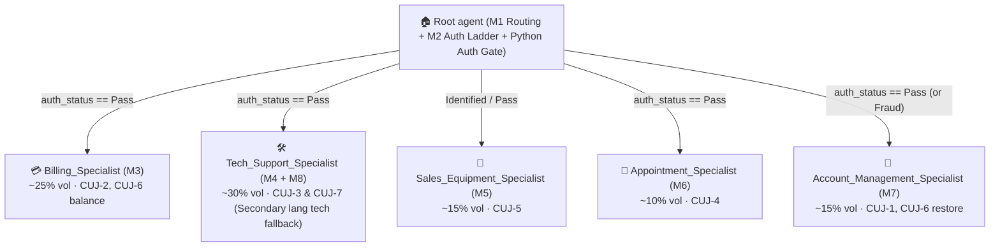

# Technical Design Document (TDD) — Telco Voice Central

> **Mode:** `draft` (Generated from `GUIA_TELCO_VOICE_CENTRAL.md` & `sources/telco-voice-central-spec.md`)
> **App ID:** `844c20f7-c058-424e-8ce2-6a66e4ef4ddb` (`projects/fde-bootcamp/locations/us/apps/844c20f7-c058-424e-8ce2-6a66e4ef4ddb`)
> **Modality:** `audio` (`gemini-3.1-flash-live`)

---

## 1. Agent Design

### 1.1 Architecture

- **Modality & Model:** Voice/Audio (`audio`), `gemini-3.1-flash-live`.
- **Topology:** **Hub-and-Spoke** architecture with 1 Central Hub (`Root agent` covering **M1 + M2**) and 5 Domain Specialists covering **M3–M8** (`M8` secondary-language tech fallback lives inside `Tech_Support_Specialist`).
  - **Why `M1 + M2` in `Root agent`?** Putting `M2` (OTP/PIN verification) directly in `Root agent` avoids an extra agent-to-agent transfer at the start of every call: `Root agent` greets, identifies (`fetch_customer_profile`), authenticates (`send_authentication_otp` $\rightarrow$ `validate_authentication_otp`), and only transfers to `M3`–`M7` once `auth_status == "Pass"`.
  - **How do we guarantee 0 unauthenticated actions (`BR-TV-008`)?** Via a **Double Python Lock** (not relying on prompt obedience alone):
    1. **Lock 1 (Tool-Level Guard in Python):** Every protected tool (`fetch_recent_bills`, `send_password_reset_sms`, `execute_suspend_restore`, `commit_appointment_reschedule`, etc.) checks `state.get("auth_status") == "Pass"` on line 1. If not `"Pass"`, the Python function refuses execution and returns `{"error": "AUTH_REQUIRED", "message": "Must complete OTP/PIN verification first"}`.
    2. **Lock 2 (`before_model_callback` Gate):** When `auth_status != "Pass"`, the callback injects a hard blocking directive preventing specialist transfers (except immediate `fraud_escalation` or `user_requested_agent`), and `auth_status = "Pass"` can **only** be written by the Python code of `validate_authentication_otp` / `validate_authentication_pin`.

| Agent Name | Modules Covered | Responsibilities | Child Agents |
| :--- | :---: | :--- | :--- |
| **`Root agent`** | **M1 + M2** | **M1 (Lifecycle & Routing):** Emits verbatim `recording_notice` + `greeting_main` (`BR-TV-001`), detects & locks `language` (`BR-TV-004`), captures `utterance`, runs `evaluate_routing_rules`, handles mid-call topic switches (`BR-TV-019`), and handles explicit `"talk to a person"` (`live_agent_handoff` + `user_requested_agent`). **M2 (Auth & Identity Ladder):** Resolves profile via `fetch_customer_profile` (`Guest` $\rightarrow$ `Identified`), executes the 6-step OTP flow (`send_authentication_otp` $\rightarrow$ verbatim `id_verification_otp` $\rightarrow$ `validate_authentication_otp`) or 4-step DTMF-only PIN fallback (verbatim `id_verification_pin` $\rightarrow$ `validate_authentication_pin`) to reach `Authenticated` (`auth_status == "Pass"`), escalates on 3rd failure (`auth_failure_handoff`), and only then transfers to `M3`–`M7`. | `Billing_Specialist`, `Tech_Support_Specialist`, `Sales_Equipment_Specialist`, `Appointment_Specialist`, `Account_Management_Specialist` |
| **`Billing_Specialist`** | **M3** | Looks up bills (`fetch_recent_bills`), identifies charges, applies auto-eligible adjustments/refunds with verbatim `refund_confirmation_pattern` (`CUJ-2`), creates disputes (`create_dispute_ticket`), configures autopay with verbatim `payment_method_preamble`, clears overdue balances (`process_payment`) for `CUJ-6`, escalates refunds over `loyalty_limit` (`refund_threshold_exceeded`). | None (returns to `Root agent`) |
| **`Tech_Support_Specialist`** | **M4 + M8** | **M4 (Tech Support & VR):** Checks regional outages first (`check_regional_outage` $\rightarrow$ verbatim `outage_active` if active), disambiguates `tv_sub_type` (`streaming` \| `satellite` \| `streaming_only`) before starting VR (`start_virtual_repair`), offers SMS troubleshooting (`send_sms`) whenever instructions exceed 2 steps (`CUJ-3`), and routes back to `Root agent` $\rightarrow$ `Appointment_Specialist` if a technician visit is needed. **M8 (Secondary Language Fallback):** When `language == "secondary"`, serves tech queries 100% in the secondary language without primary-language degradation (`BR-TV-020`), and if a symptom is unsupported, emits localized `live_agent_handoff` and escalates with `reason: secondary_language_live_agent` (`CUJ-7`). | None (returns to `Root agent`) |
| **`Sales_Equipment_Specialist`** | **M5** | Immediately transfers business accounts (`business_flag == "true"`) using verbatim `business_handoff` (`reason: business_handoff`, `BR-TV-012`). Checks service coverage (`check_service_coverage`) before presenting **2–3 curated plans** (`fetch_plan_catalog`), places orders (`place_new_order`), reads order number + ETA, sends SMS receipt (`CUJ-5`), and handles warranty (`process_warranty_claim`) & number port-in (`initiate_number_transfer`). | None (returns to `Root agent`) |
| **`Appointment_Specialist`** | **M6** | Looks up active appointments (`lookup_active_appointments`) before offering 2–3 slots (`fetch_availability_slots`), commits reschedule/cancel (`commit_appointment_reschedule`), repeats new date/time to caller, sends SMS confirmation (`CUJ-4`), enforces double confirmation on same-day cancellation, blocks cancellation when technician is `en-route`. | None (returns to `Root agent`) |
| **`Account_Management_Specialist`** | **M7** | Dispatches self-serve password reset SMS (`send_password_reset_sms`, states 30-min validity, never echoes link, `CUJ-1`), handles fraud claims immediately with verbatim `empathy_protocol` + `fraud_escalation` (no auth/self-serve, `BR-TV-013`), manages MFA (`manage_mfa` with step-up auth), suspends lost/stolen lines immediately (`execute_suspend_restore`), and coordinates non-payment restore (`CUJ-6`) by handing back to `Root agent` (`utterance="pay balance"`) before restoring and sending SMS confirmation. | None (returns to `Root agent`) |

---

### 1.2 Tools

All tools are implemented as Python Function tools in `tools/<tool_name>/` and **must** satisfy Section 17 requirements:
1. **`mock_mode` branch:** When `mock_mode == "True"`, return deterministic synthetic success payloads without calling external backends.
2. **Error envelope:** `{ "error": "<CODE>", "message": "<human>" }` (`System`, `Business`, or `Validation` codes per Section 6).
3. **Idempotency & PII redaction:** Safe to retry on same input; never expose unredacted PII in spoken output.

| Tool Name | Type | Category | Input Schema | Output Schema | Purpose / Requirement |
| :--- | :--- | :--- | :--- | :--- | :--- |
| `fetch_customer_profile` | Python function | Identity | `clid: str`, `account_or_phone: str` (optional) | `{ identification_status, customer_type, business_flag, is_prepaid, cirn, billing_account, region, user_id, suspension_reason }` | Resolves caller identity (`Guest` $\rightarrow$ `Identified`), sets `identification_status` (`Pass`\|`Fail`). |
| `send_authentication_otp` | Python function | Auth | `clid: str` | `{ sent: bool, expires_in_sec: int, callback_last4: str }` | Dispatches 6-digit OTP to caller's number (`M2`). |
| `validate_authentication_otp` | Python function | Auth | `code: str` | `{ auth_status: "Pass"\|"Fail", attempts_remaining: int }` | Validates 6-digit OTP (`M2`, `BR-TV-008`). Sets `auth_status`. |
| `validate_authentication_pin` | Python function | Auth | `pin: str`, `is_dtmf: bool` | `{ auth_status: "Pass"\|"Fail", attempts_remaining: int }` | Validates 4-digit DTMF PIN (`M2`). Rejects voice-spelled PINs. |
| `evaluate_routing_rules` | Python function | Routing | `utterance: str`, `entities: dict` | `{ route: str, confidence: float, requires_auth: bool, lob: str }` | Classifies intent into `M3`–`M8` and checks if `Authenticated` state is required. |
| `fetch_recent_bills` | Python function | Billing | `billing_account: str` | `{ bills: [{ id, date, amount, line_items, balance_due }] }` | Looks up recent statements and unrecognized charges (`M3`, `CUJ-2`). |
| `apply_bill_adjustment` | Python function | Billing | `charge_id: str`, `amount: float` | `{ adjusted: bool, amount: float, days: int, refund_confirmation_text: str }` | Credits auto-eligible small-dollar disputed charges (`M3`, `CUJ-2`) and formats `refund_confirmation_pattern`. |
| `create_dispute_ticket` | Python function | Billing | `charge_id: str`, `reason: str`, `notes: str` | `{ ticket_id: str, eta_business_days: int }` | Opens formal billing dispute when charge is not auto-eligible (`M3`). |
| `process_payment` | Python function | Billing | `billing_account: str`, `amount: float`, `dtmf_payment_token: str` | `{ paid: bool, remaining_balance: float, transaction_id: str }` | Pays bill or clears past-due balance for `CUJ-6` (`M3`). |
| `configure_autopay` | Python function | Billing | `billing_account: str`, `enabled: bool`, `dtmf_payment_token: str` | `{ autopay_enabled: bool, preamble_emitted: bool }` | Enrolls/updates autopay (`M3`). |
| `check_regional_outage` | Python function | Tech Support | `region: str`, `lob: str` | `{ active: bool, restoration_eta_iso: str \| None }` | Mandatory first check in `M4` (`CUJ-3`). |
| `start_virtual_repair` | Python function | Tech Support | `cirn: str`, `lob: str`, `symptom: str`, `tv_sub_type: str` | `{ session_id: str, first_diagnostic_question: str, steps_count: int, troubleshooting_steps: list }` | Starts guided VR diagnostic session in `M4` (`CUJ-3`). |
| `check_service_coverage` | Python function | Sales | `address_or_zip: str`, `lob: str` | `{ covered: bool, region: str, available_speeds: list }` | Mandatory coverage check before offering plans in `M5` (`CUJ-5`). |
| `fetch_plan_catalog` | Python function | Sales | `lob: str`, `customer_type: str` | `{ plans: [{ id, name, price, key_features }] }` | Returns curated shortlist of 2–3 comparable plans (`M5`, `CUJ-5`). |
| `place_new_order` | Python function | Sales | `cirn: str`, `plan_id: str`, `lob: str` | `{ order_id: str, delivery_eta: str, sms_receipt_sent: bool }` | Places equipment/plan order and dispatches SMS receipt (`M5`, `CUJ-5`). |
| `process_warranty_claim` | Python function | Sales | `cirn: str`, `device_id: str`, `intent_type: str` | `{ claim_id: str, in_warranty: bool, replacement_eta: str }` | Handles defective vs physical damage warranty claims (`M5`). |
| `lookup_active_appointments` | Python function | Appointments | `cirn: str` | `{ appointments: [{ appt_id, date, window, service_type, technician_status }] }` | Mandatory lookup before offering reschedule slots (`M6`, `CUJ-4`). |
| `fetch_availability_slots` | Python function | Appointments | `zip: str`, `service_type: str` | `{ slots: [{ slot_id, date, window, technician_id }] }` | Returns 2–3 available technician appointment windows (`M6`, `CUJ-4`). |
| `commit_appointment_reschedule` | Python function | Appointments | `appt_id: str`, `new_slot: str`, `action: str` | `{ confirmed: bool, new_date: str, new_window: str, sms_sent: bool }` | Commits appointment booking/reschedule/cancel and sends SMS (`M6`, `CUJ-4`). |
| `send_password_reset_sms` | Python function | Account | `cirn: str` | `{ sent: bool, valid_minutes: int }` | Sends 30-min validity self-serve password reset link via SMS (`M7`, `CUJ-1`). |
| `execute_suspend_restore` | Python function | Account | `cirn: str`, `action: str`, `reason: str` | `{ new_state: str, effective_iso: str, sms_sent: bool }` | Suspends or restores service (`M7`, `CUJ-6`) and sends SMS confirmation. |
| `send_sms` | Python function | SMS | `clid: str`, `sms_type: str`, `sms_content: str` | `{ sent: bool, message_id: str }` | Dispatches troubleshooting steps (>2 steps in `M4`), confirmations, and receipts. |
| `execute_live_agent_handover` | Python function | Handoff | `reason: str`, `session_context: dict` | `{ handover_id: str, queue: str, ended: bool }` | Transfers caller to human queue with full session variables (`BR-TV-015`) and reason code. |
| `end_session` | System / Python | System | `reason: str` | `{ terminated: bool, reason: str }` | Terminates the call session cleanly with a required audit `reason` code. |

---

### 1.3 Routing Logic

1. **Entry & Pre-Greeting Sequence (Section 3, `Root agent`):**
   - Check `clid` against blocklist (`BR-TV-002`). If blocked $\rightarrow$ play deflection and disconnect.
   - Check if regional service alert is active (`BR-TV-003`). If active $\rightarrow$ prepend advisory banner.
   - Emit verbatim `recording_notice` + `greeting_main` (`BR-TV-001`).
   - Lock `language` (`primary` or `secondary`) on Turn 1 from `clid` area code + first utterance (`BR-TV-004`).
2. **Priority Hierarchy Override (Section 20 — checked every turn before normal routing):**
   - **P1 Safety / Malicious (`BR-TV-016`):** `empathy_protocol` / polite closing $\rightarrow$ `end_session(reason="malicious_input")`.
   - **P2 Fraud Claim (`BR-TV-013`):** Verbatim `empathy_protocol` $\rightarrow$ `execute_live_agent_handover(reason="fraud_escalation")` (NO auth attempt).
   - **P3 System Error (`BR-TV-010`):** Any tool returning `SYSTEM_DOWN`, `INTERNAL_ERROR`, or `AUTH_SERVICE_UNAVAILABLE` $\rightarrow$ `execute_live_agent_handover(reason="system_unavailable")`.
   - **P4 Explicit Live Agent Request:** Caller asks for a human $\rightarrow$ verbatim `live_agent_handoff` $\rightarrow$ `execute_live_agent_handover(reason="user_requested_agent")`.
   - **P5 Business Account (`BR-TV-012`):** `business_flag == "true"` in `M5` $\rightarrow$ verbatim `business_handoff` $\rightarrow$ `execute_live_agent_handover(reason="business_handoff")`.
   - **P6 Retry Strikes (`BR-TV-006`):** `local_noinput_counter >= 3` $\rightarrow$ `no_input_escalation`; `no_match_confirmation_count >= 3` $\rightarrow$ `disambig_max_attempts`; `global_err_count >= 3` $\rightarrow$ `too_many_errors`.
3. **Authentication Gate (`M2` in `Root agent`, `BR-TV-008` — 3-Layer Python Lock):**
   - `fetch_customer_profile` resolves `identification_status = "Pass"`.
   - Any intent reading or mutating account data (`M3`, `M4`, `M5` orders/warranty/transfer, `M6`, `M7` including `CUJ-1` password reset, `M8`) **must** complete OTP (`validate_authentication_otp`) or PIN (`validate_authentication_pin`) verification so `auth_status == "Pass"` before routing to the specialist:
     - **Lock 1 (Tool-level Python check):** Protected tools check `context.state.get("auth_status") == "Pass"` on line 1 and return `{"error": "AUTH_REQUIRED", "message": "..."}` if not `"Pass"`.
     - **Lock 2 (Exclusive state mutation):** Only `validate_authentication_otp` and `validate_authentication_pin` can set `context.state["auth_status"] = "Pass"`.
     - **Lock 3 (`before_model_callback` prompt gate):** Injects a `[HARD AUTH GATE]` blocking specialist transfers while `auth_status != "Pass"`.
4. **Cross-Module Pivot (`BR-TV-019`) & `CUJ-6` Non-Payment Restore:**
   - Specialist agents never transfer directly to another specialist (`M7` $\not\rightarrow$ `M3`).
   - In `CUJ-6`, when `Account_Management_Specialist` (`M7`) detects `suspension_reason == "non_payment"`, it hands back to `Root agent` (`M1`) with `utterance = "pay balance"`. `Root agent` routes to `Billing_Specialist` (`M3`) to clear the balance (`process_payment`), returns to `Root agent` (`M1`), and routes back to `Account_Management_Specialist` (`M7`) to call `execute_suspend_restore(action="restore")` and send the SMS confirmation.

---

### 1.4 Variables

All canonical variables from Section 5 are declared in `app.json` (`variableDeclarations`):

| Variable Name | Type | Source | Evals Override Rule | Description |
| :--- | :--- | :--- | :--- | :--- |
| `clid` | `string` | Session param | Allowed | 10-digit caller ID from telephony |
| `tfn` | `string` | Session param | Allowed | Toll-free number dialed |
| `cirn` | `string` | Tool / Captured | Allowed | Customer reference number (**PII: echo last-4 only**) |
| `billing_account` | `string` | Tool / Captured | Allowed | Billing account number (**PII: echo last-4 only**) |
| `customer_type` | `string` | Tool (`fetch_customer_profile`) | Allowed | `New` \| `Existing` |
| `user_id` | `string` | Tool (`fetch_customer_profile`) | Allowed | Internal CRM record ID |
| `auth_status` | `string` | Tool (`validate_authentication_*`) | **NEVER override in evals** | `Pass` \| `Fail` (must come from auth verify tool) |
| `identification_status` | `string` | Tool (`fetch_customer_profile`) | **NEVER override in evals** | `Pass` \| `Fail` (must come from profile lookup tool) |
| `business_flag` | `string` | Tool (`fetch_customer_profile`) | Allowed | `"true"` \| `"false"` (triggers `business_handoff`) |
| `route` | `string` | Tool / Classified | Derived | Target capability module (`M3`..`M8`) |
| `lob` | `string` | Captured / Tool | Allowed | `mobility` \| `internet` \| `tv` \| `homephone` \| `smarthome` |
| `tv_sub_type` | `string` | Captured | Allowed | `streaming` \| `satellite` \| `streaming_only` \| `null` |
| `region` | `string` | Tool (`fetch_customer_profile`) | Allowed | `Region-A` \| `Region-B` \| `Region-C` |
| `language` | `string` | Callback / Detected Turn 1 | Allowed | `primary` \| `secondary` (locked at Turn 1) |
| `utterance` | `string` | Captured / Callback | Derived | Latest caller intent text |
| `dtmf_digits` | `string` | `before_model_callback` | Derived | Normalized DTMF digits entered on the current turn |
| `local_noinput_counter` | `integer` | `before_model_callback` / `before_agent_callback` | Derived | Per-module no-input counter (resets to `0` on agent entry; escalates at 3) |
| `global_err_count` | `integer` | `before_model_callback` / `after_tool_callback` | Derived | Cross-module validation error counter (escalates at 3) |
| `no_match_confirmation_count` | `integer` | `before_model_callback` | Derived | Disambiguation retry counter (escalates at 3) |
| `misc_counter` | `integer` | Callback / Tool | Derived | Generic per-flow counter (e.g., auth attempts) |
| `mock_mode` | `string` | Eval harness session param | **Set to `"True"` in evals** | Instructs all tools to return deterministic synthetic payloads |
| `last_pmt_amt` | `string` | Tool | Allowed | Last payment amount |
| `amount` | `string` | Captured / Tool | Allowed | Currently discussed dollar amount |
| `ban_type` | `string` | Tool | Allowed | Billing account type |
| `is_prepaid` | `string` | Tool | Allowed | `"true"` \| `"false"` |
| `loyalty_limit` | `integer` | Tool | Allowed | Auto-refund / adjustment ceiling (e.g., `50`) |
| `vr_task_count` | `integer` | Tool | Derived | Virtual-repair iteration counter |
| `ticket_state` | `string` | Tool | Allowed | `open` \| `in-progress` \| `closed` |
| `item_list` | `string` | Captured | Allowed | Captured equipment list |
| `intent_type` | `string` | Captured | Allowed | Sub-intent classification (`Physical Damage` vs `Defective`) |
| `api_resp` | `string` | Tool | Derived | Last API response payload |
| `sms_type` | `string` | Captured | Allowed | `Public` \| `Private` |
| `sms_content` | `string` | Captured | Derived | SMS body text |
| `day_val`, `date_val`, `month_val`, `end_time`, `flag_val` | `string` | Captured | Allowed | Per-flow temporary state variables |

---

### 1.5 Callbacks

| Agent | Callback Type | Function Name | Purpose & Strict Ordering (Section 6) |
| :--- | :--- | :--- | :--- |
| **All Agents** (`Root agent` + `M3`–`M7`) | `before_agent_callback` | `reset_module_counters_callback` | Runs whenever the conversation lands on a new agent/module: resets `session.state["local_noinput_counter"] = 0` (`BR-TV-006`). |
| **All Agents** (`Root agent` + `M3`–`M7`) | `before_model_callback` | `preprocess_turn_callback` | Runs on **every turn before the model composes a response** in the exact order mandated by Section 6: 1. **DTMF capture (`BR-TV-007`):** Extracts native DTMF or `"user pressed 1234"` patterns into `session.state["dtmf_digits"]`. 2. **No-input accounting (`BR-TV-006`):** Increments `local_noinput_counter` on empty/no-input turns; escalates at `3` with `reason="no_input_escalation"`. 3. **Tool-error classification (`BR-TV-010`):** Inspects `api_resp` for `SYSTEM_DOWN`/`INTERNAL_ERROR`/`AUTH_SERVICE_UNAVAILABLE` ($\rightarrow$ `system_unavailable`) and `INVALID_INPUT`/`MALFORMED_REQUEST` ($\rightarrow$ increments `global_err_count`, escalates at `3` with `too_many_errors`). 4. **Module & Global Pre-checks:** Enforces Turn-1 language detection & locking (`language="primary"` vs `"secondary"`, `language_locked=True` per `BR-TV-004`), injects `VERBATIM_COPY[language]` constants into dynamic instructions, runs restricted caller check (`BR-TV-002`), malicious utterance classifier (`BR-TV-016` $\rightarrow$ `malicious_input`), and enforces the `[HARD AUTH GATE]` when `auth_status != "Pass"`. |
| **All Agents** | `after_tool_callback` | `postprocess_tool_callback` | Flattens nested tool output fields into top-level session state variables (`identification_status`, `auth_status`, `cirn` redacted to last-4, `billing_account` redacted to last-4, `api_resp`) so downstream turns see them immediately (Section 6 Post-Turn Hooks). |

---

## 2. Eval Design

### 2.1 Coverage Map

| Requirement / CUJ | Eval Type | Rationale | Priority | Severity | Tags |
| :--- | :--- | :--- | :---: | :---: | :--- |
| **`cuj_1_account_password_reset`** (`M7`) | **Sim + Golden** | Tests full auth ladder (`M2`) $\rightarrow$ `send_password_reset_sms` (`M7`), stating 30-min validity without echoing the reset URL or resetting password inline. | **P0** | **NO-GO** | `CUJ-1`, `M7`, `BR-TV-008`, `BR-TV-009` |
| **`cuj_2_billing_dispute_auto_eligible`** (`M3`) | **Sim + Golden** | Tests `fetch_recent_bills` before naming a charge, auto-adjusting a $12 charge (`apply_bill_adjustment`) without opening a dispute ticket, and emitting verbatim `refund_confirmation_pattern`. | **P0** | **NO-GO** | `CUJ-2`, `M3`, `BR-TV-011` |
| **`cuj_3_tech_support_tv_signal`** (`M4`) | **Sim** | Tests mandatory diagnostic sequence: `check_regional_outage` first $\rightarrow$ disambiguate `tv_sub_type` $\rightarrow$ `start_virtual_repair` $\rightarrow$ offer SMS when steps > 2. | **P0** | **NO-GO** | `CUJ-3`, `M4`, `BR-TV-005` |
| **`cuj_4_appointment_reschedule`** (`M6`) | **Sim** | Tests `lookup_active_appointments` first $\rightarrow$ offer 2–3 slots (`fetch_availability_slots`) $\rightarrow$ `commit_appointment_reschedule` $\rightarrow$ state new date/time + send SMS. | **P0** | **HIGH** | `CUJ-4`, `M6` |
| **`cuj_5_sales_add_tv_existing`** (`M5`) | **Sim** | Tests `check_service_coverage` first $\rightarrow$ present 2–3 comparable plans (`fetch_plan_catalog`) $\rightarrow$ `place_new_order` $\rightarrow$ state order number + ETA + SMS. | **P0** | **HIGH** | `CUJ-5`, `M5` |
| **`cuj_6_restore_service_from_non_payment`** (`M7` $\leftrightarrow$ `M1` $\leftrightarrow$ `M3`) | **Sim** | Tests suspended account for non-payment: `M7` refuses restore before payment, routes via `M1` (`Root agent`) to `M3` (`process_payment`), returns via `M1` to `M7` (`execute_suspend_restore`) + SMS confirmation. | **P0** | **NO-GO** | `CUJ-6`, `M7`, `M3`, `BR-TV-019` |
| **`cuj_7_secondary_language_tech_fallback`** (`M8`) | **Sim** | Tests secondary language locking (`language="secondary"`), routing to `M8`, zero primary-language leakage (`BR-TV-020`), and escalation with `secondary_language_live_agent`. | **P0** | **NO-GO** | `CUJ-7`, `M8`, `BR-TV-004`, `BR-TV-020` |
| **Verbatim Compliance & Escalation Goldens** (`BR-TV-001`..`016`) | **Golden** | Deterministic turn-by-turn checks for `recording_notice`, `greeting_main`, `empathy_protocol` + `fraud_escalation`, `business_handoff`, `outage_active`, `live_agent_handoff` + `user_requested_agent`, and PII last-4 redaction. | **P0** | **NO-GO** | `BR-TV-001`, `BR-TV-009`, `BR-TV-011`, `BR-TV-012`, `BR-TV-013` |
| **Tool-Contract Tests (100% tools)** | **Tool Tests** | Verifies every tool's `mock_mode == "True"` branch and error envelope structure (`{ "error": "<CODE>", "message": "..." }`). | **P0** | **HIGH** | `Section-17`, `tool_tests` |
| **Per-Turn Preprocessing Tests (Section 6)** | **Callback Tests** | Unit-tests `preprocess_turn_callback` for 1. DTMF normalization, 2. 3-strike `no_input_escalation`, 3. `system_unavailable` & `too_many_errors`, 4. `malicious_input`. | **P0** | **HIGH** | `Section-6`, `callback_tests` |

---

### 2.2 Test Data (Synthetic Profiles for `mock_mode == "True"`)

| Profile ID | `clid` | `cirn` (last-4) | `billing_account` (last-4) | `customer_type` | `business_flag` | `region` | Scenario Purpose |
| :--- | :--- | :--- | :--- | :--- | :--- | :--- | :--- |
| **P1 — Standard Existing** | `4155550101` | `9988774321` (`4321`) | `1000205678` (`5678`) | `Existing` | `"false"` | `Region-A` | Default profile for `CUJ-1` (Password Reset), `CUJ-2` ($12.50 AppleStreaming dispute), `CUJ-3` (TV no signal), `CUJ-4` (Reschedule appt), `CUJ-5` (Add TV). |
| **P2 — Suspended Non-Payment** | `4155550102` | `9988778899` (`8899`) | `1000209900` (`9900`) | `Existing` | `"false"` | `Region-B` | Profile with `suspension_reason="non_payment"` and `$45.00` overdue balance for `CUJ-6`. |
| **P3 — Business Account** | `4155550103` | `9988771122` (`1122`) | `1000201122` (`1122`) | `Existing` | `"true"` | `Region-A` | Triggers immediate verbatim `business_handoff` (`BR-TV-012`). |
| **P4 — Active Outage Region** | `4155550104` | `9988773344` (`3344`) | `1000203344` (`3344`) | `Existing` | `"false"` | `Region-C` | `Region-C` returns `active: True` in `check_regional_outage` (`outage_active` golden). |
| **P5 — Secondary Language (`es-US`)** | `3055550199` | `9988776655` (`6655`) | `1000206655` (`6655`) | `Existing` | `"false"` | `Region-A` | Spanish caller (`language="secondary"`) for `CUJ-7` (`M8`). |

---

## 3. Tracking

### 3.1 Pass Rate History

| Iteration | Date | Goldens | Sim Scenarios (`CUJ-1`..`7`) | Tool Tests | Callback Tests | Notes |
| :---: | :--- | :---: | :---: | :---: | :---: | :--- |
| — | — | — | — | — | — | Pending initial scaffold & push |

### 3.2 Known Issues & Design Notes

1. **CUJ-1 Auth Requirement vs Section 4 Table:** Section 4 table lists `"forgot my password"` as `Identified only`, whereas Section 19 (`cuj_1_account_password_reset`) explicitly requires `"Agent must authenticate before dispatching the link"`. **Resolution:** We enforce full authentication (`auth_status == "Pass"`) before calling `send_password_reset_sms` so `cuj_1` passes 100% of the time while remaining compliant with `BR-TV-008`.
2. **Placeholder Legal Strings in Section 7:** Section 7 marks `payment_method_preamble` and `contract_cancellation_fee_disclosure` as *(obtain from Legal)*. We define canonical deterministic constants for both (`"For your security, please do not speak your card number aloud. Use your keypad when prompted."` and `"Please note that cancelling your service before the end of your contract term may result in an early termination fee on your final bill."`) and expose them by key so golden assertions match deterministically.

### 3.3 Changelog

- **2026-09-22:** Initial requirements-derived TDD draft created from `Telco Voice Central Agent Development Brief` (`GUIA_TELCO_VOICE_CENTRAL.md`).

---
*Review and approve before scaffolding the agent.*
